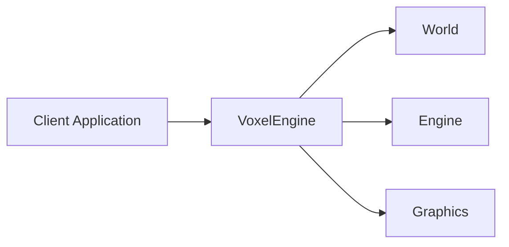

# voxel-engine

`voxel-engine` is a reusable C++ voxel engine core with a Vulkan rendering backend.
It is designed as a library that client applications can integrate to manage voxel world data, run CPU-side meshing, and render through an explicit graphics runtime.

## What This Project Is

- A modular voxel engine library
- A codebase structured around clear ownership and explicit runtime lifecycles
- A split architecture with:
  - **World** for data
  - **Engine** for CPU-side processing
  - **Graphics** for Vulkan rendering
- A small public facade, `VoxelEngine`, used by client applications

## What This Project Is Not

- Not a full game engine
- Not a gameplay framework
- Not a complete editor or content pipeline
- Not a backend-agnostic renderer
- Not a finalized long-term public API

## Architecture

The engine is organized around one public entry point and three internal layers.

- **VoxelEngine**
  - public facade used by external code
- **World**
  - chunks, voxels, and world-side state
- **Engine**
  - CPU meshing, mesh caching, and render synchronization
- **Graphics**
  - Vulkan runtime, GPU uploads, and frame rendering



This split keeps voxel storage, CPU processing, and GPU/runtime code separate while preserving a small integration surface for users of the library.

## Build

Requirements:

- CMake 3.24+
- A C++20 compiler
- Vulkan SDK or Vulkan development libraries

Basic build:

```bash
cmake -S . -B build -DCMAKE_BUILD_TYPE=Release
cmake --build build -j
```

This builds the `voxel_engine` library target.
For build and integration details, see [docs/build.md](docs/build.md).

## Integration

`voxel-engine` is meant to be embedded into a client application as a library.

At a high level, the client is expected to:

1. Configure `VoxelEngineInitConfig`
2. Provide the required Vulkan host callbacks and extensions
3. Initialize `VoxelEngine`
4. Drive `update(...)` and `render(...)`
5. Shut the engine down explicitly

The client remains responsible for host-side concerns such as window ownership, event handling, and surface creation.

For integration details, see:

- [docs/build.md](docs/build.md)
- [docs/public-api.md](docs/public-api.md)

## Documentation

Documentation entry point: [docs/index.md](docs/index.md)
