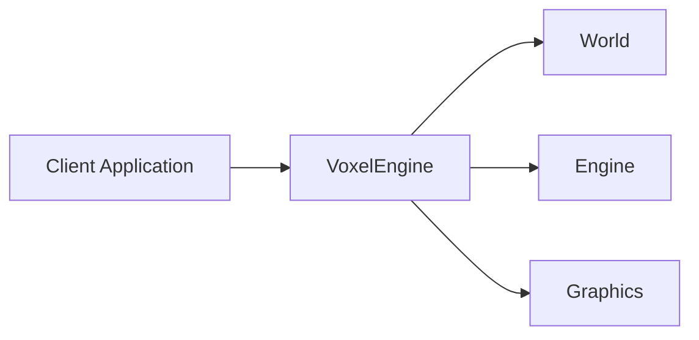
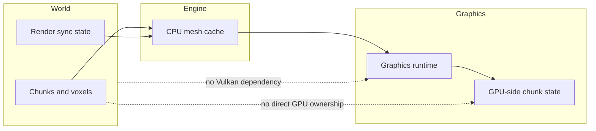

# Architecture Overview

`voxel-engine` is organized around a small public facade and three internal layers.
The purpose of this split is simple: keep world data, CPU processing, and GPU/runtime code separate so each part has a clear role and a clear owner.

## High-Level Structure

- **VoxelEngine**
  - the public entry point used by client code
  - coordinates the internal layers
- **World**
  - stores chunks, voxels, and world-side state
- **Engine**
  - turns world data into CPU mesh data
  - synchronizes CPU-side results toward rendering
- **Graphics**
  - owns the Vulkan runtime, GPU resources, and frame execution

## Why This Split Exists

- **World** stays simple and data-oriented
  - chunk storage does not need rendering or Vulkan knowledge
- **Engine** owns CPU-side interpretation
  - meshing and CPU mesh caching happen before any GPU work
- **Graphics** owns runtime and GPU state
  - rendering resources are not mixed into world objects
- **VoxelEngine** keeps the public API small
  - clients do not need to orchestrate the internal systems themselves

## Layer Responsibilities

### World

- Owns chunk and voxel data
- Owns world-side modification state
- Does not generate meshes
- Does not own GPU resources

### Engine

- Reads world data that needs processing
- Builds CPU mesh data
- Stores CPU mesh results in a mesh cache
- Synchronizes those results toward graphics-side state
- Does not own Vulkan runtime objects

### Graphics

- Owns the Vulkan backend
- Owns persistent GPU resources and swapchain-dependent resources
- Owns graphics-side chunk render state
- Executes frame rendering
- Does not own world voxel data

### VoxelEngine

- Exposes the public lifecycle: init, update, render, shutdown
- Exposes world-editing entry points
- Coordinates World, Engine, and Graphics
- Does not flatten the internal architecture into one large subsystem

## Ownership Boundaries

The key ownership rule is that rendering state lives outside world chunks.
Chunks store voxel content. CPU meshing produces mesh data from that content. Graphics owns the GPU-side representation used for rendering.

## Key Design Decisions

- **World / Engine / Graphics**
  - keeps data storage, CPU processing, and GPU/runtime work separate
- **Rendering state is outside chunks**
  - world data stays independent from Vulkan and GPU allocation details
- **CPU meshes are cached before GPU upload**
  - synchronization has a stable CPU-side handoff point
- **VoxelEngine exists as a facade**
  - the public API stays small even though the runtime is modular
- **No globals or singletons**
  - ownership, initialization, and shutdown stay explicit
