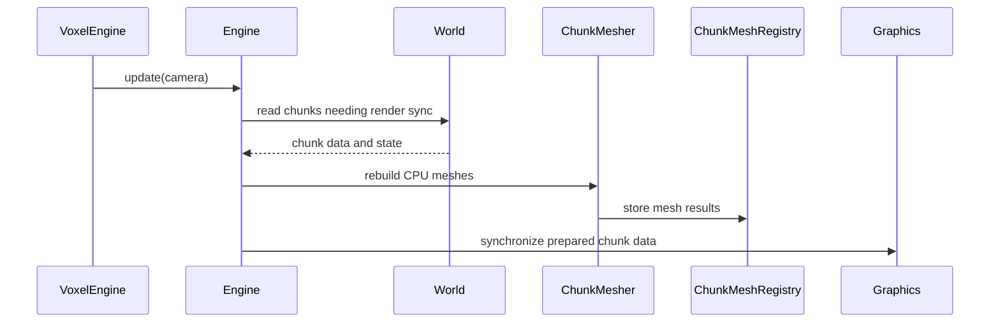
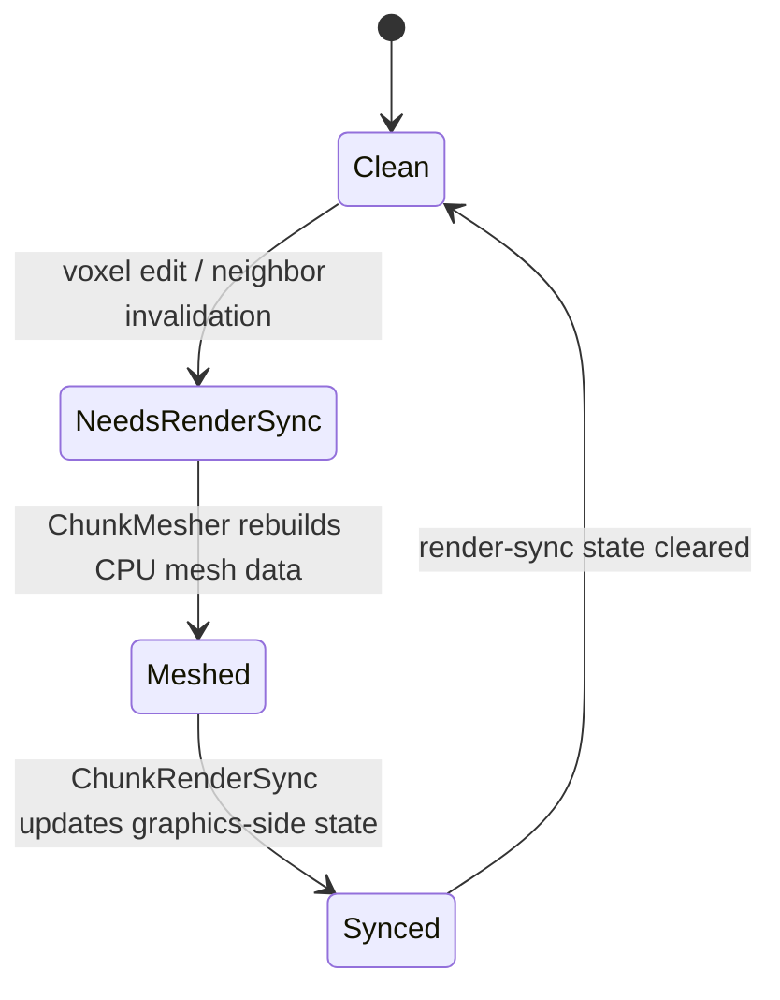

# Engine Layer

## Purpose

The Engine layer is the CPU-side processing layer between world storage and rendering.

Its role is to:

- transform voxel world data into renderable mesh data on the CPU
- cache those CPU-side mesh results
- synchronize that CPU state toward the graphics runtime

It does not own the world itself, and it does not directly implement the Vulkan backend.

## CPU-Side Processing

The Engine layer consumes world data that has been marked as needing render synchronization and produces mesh data suitable for rendering.

At a high level, it is where:

- chunk voxel content is interpreted geometrically
- visible faces are selected
- opaque and transparent mesh results are built

This keeps geometry generation separate from both raw world storage and GPU upload.

## Render Synchronization State

The Engine layer currently relies on a chunk state that means more than a simple local modification flag.

In the current code, a chunk marked as needing render synchronization is:

- eligible for CPU meshing
- still considered pending for render synchronization afterward
- cleared only after the render synchronization step consumes the updated CPU mesh state

This is why the current naming is closer to "needs render synchronization" than to a generic "dirty chunk" flag.

## Meshing Pipeline

The CPU meshing pipeline is centered around:

- `ChunkMesher`
- `MeshBuilder`

### `ChunkMesher`

`ChunkMesher` is responsible for deciding which chunks need CPU-side mesh work and triggering that work.

It operates on chunks that are marked as needing render synchronization and runs the meshing stage over them.

### `MeshBuilder`

`MeshBuilder` performs the actual mesh construction work.

At a high level, it:

- reads voxel content from one chunk
- queries neighboring chunks when face visibility depends on chunk borders
- builds separate opaque and transparent mesh data

This keeps neighborhood-dependent geometry decisions inside the CPU processing layer instead of pushing them into the world or graphics layers.

## Mesh Caching

CPU-generated mesh results are stored in `ChunkMeshRegistry`.

Its role is to:

- store mesh results keyed by chunk position
- keep CPU mesh data available after meshing
- provide a stable handoff point between meshing and graphics synchronization

This avoids coupling the graphics layer directly to raw world traversal and keeps CPU-side results reusable across the rest of the frame pipeline.

## Neighborhood Access

Chunk border visibility depends on neighboring chunk contents.

That responsibility is handled in the Engine layer:

- world data stays responsible for chunk ownership and lookup
- engine-side meshing logic decides how neighboring voxel data affects mesh output

This is an important architectural boundary:

- the World layer stores data
- the Engine layer interprets that data for geometry generation

## Render Synchronization

The final step of the Engine layer is synchronization toward rendering.

This responsibility is represented by `ChunkRenderSync`.

At a high level, it:

- reads CPU mesh results from `ChunkMeshRegistry`
- reads world-side chunk state as needed
- updates graphics-side chunk render state through the graphics runtime interfaces
- clears the chunk render-sync state after that synchronization step completes

This makes `ChunkRenderSync` the bridge between:

- CPU mesh state
- graphics-side allocation and render state

## Important Boundary

The Engine layer contains:

- meshing logic
- CPU mesh caching
- synchronization logic from CPU mesh state toward graphics-side render state

The Engine layer does **not** contain:

- raw world ownership
- Vulkan resource ownership
- final frame rendering

Its job is to turn world data into CPU mesh state and push that state toward the graphics runtime in a controlled way.
