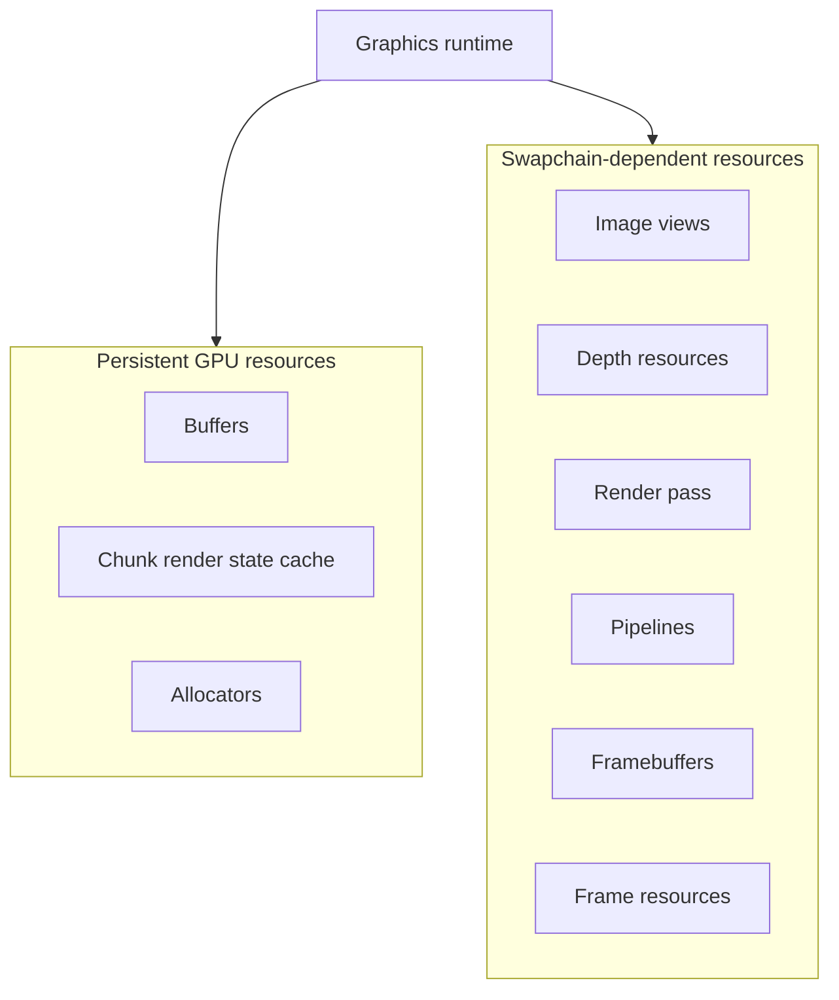
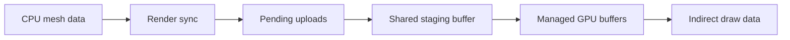
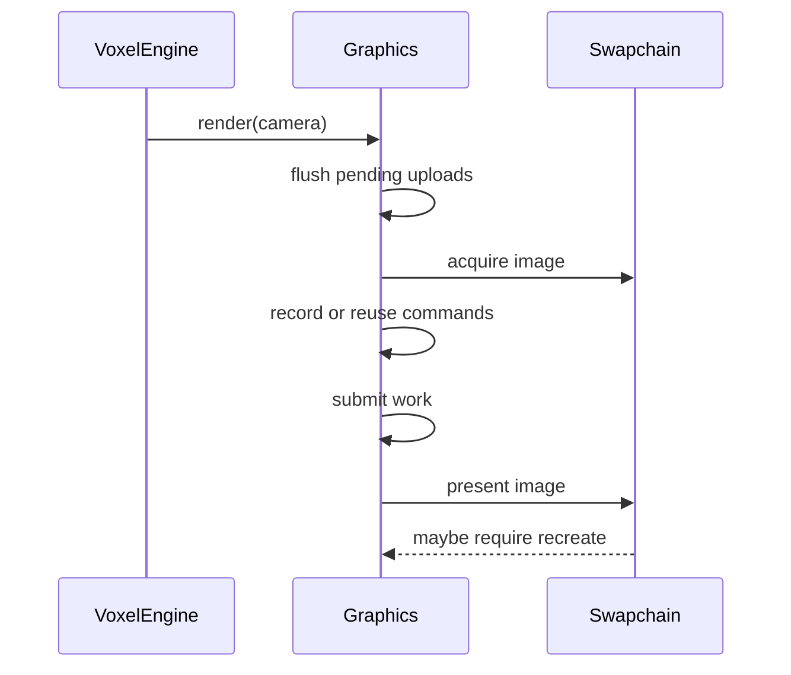

# Graphics Layer

## Purpose

The Graphics layer is the Vulkan backend of the engine.

Its role is to:

- own the Vulkan runtime
- manage GPU resources
- manage swapchain-dependent render state
- receive synchronized chunk render data from higher layers
- execute frame rendering

It is currently Vulkan-specific by design.

## Vulkan Backend Responsibilities

At a high level, the Graphics layer is responsible for:

- Vulkan instance, surface, and device setup
- swapchain creation and recreation
- render pass and pipeline setup
- descriptor and uniform resource setup
- buffer allocation and upload flow
- command buffer recording and submission
- presentation

This layer is also where graphics-side chunk state lives.
The world does not own GPU state directly.

## GPU Resource Management

The Graphics layer distinguishes between:

- **persistent GPU resources**
- **swapchain-dependent resources**

### Persistent GPU Resources

These are resources that survive normal swapchain recreation:

- chunk-related GPU buffer storage
- allocator-managed mesh buffers
- graphics-side chunk render state
- texture resources
- descriptor set layout
- long-lived backend objects such as device-level services

These resources belong to the broader runtime rather than to a particular swapchain instance.

### Swapchain-Dependent Resources

These are resources that must be rebuilt when the swapchain changes:

- swapchain storage
- swapchain image views
- depth resources
- render pass
- graphics pipelines
- framebuffers
- frame resources tied to swapchain image count

This distinction is central to the current graphics lifecycle.

## Swapchain Lifecycle

The graphics runtime monitors whether the current swapchain still matches the host framebuffer state.

When recreation is needed, the current flow rebuilds swapchain-dependent resources in a fixed order:

- cleanup of swapchain-dependent resources
- swapchain recreation
- image view recreation
- depth resource recreation
- render pass recreation
- pipeline recreation
- framebuffer recreation
- frame resource recreation

This makes resize or out-of-date handling easier to reason about than a partially implicit recreate path.

## Render Pass and Pipelines

The Graphics layer owns the render pass and the graphics pipelines used for voxel rendering.

At a high level:

- the render pass defines the current render target structure
- the pipelines define the current graphics state used for opaque and transparent draws

These resources are treated as swapchain-dependent in the current runtime lifecycle.

## Buffers and Allocators

GPU mesh storage is managed through the buffer and allocator subsystem.

At a high level, this subsystem provides:

- managed GPU buffers
- allocator-backed suballocation inside those buffers
- a single staging upload path
- separate allocation domains for opaque and transparent chunk data

This allows chunk mesh data to be uploaded and reused without placing GPU ownership into world-side chunk objects.

## Frame Resources

The Graphics layer also owns resources that are tied to frame execution, such as:

- uniform buffers
- descriptor sets based on swapchain image count
- frame command buffers
- synchronization objects used during rendering

These resources are recreated when swapchain-dependent frame state changes.

At runtime, the render path follows this high-level sequence:

## Ownership and Lifecycle Concepts

The Graphics layer is built around explicit ownership:

- the graphics runtime owns the major backend objects
- specialized runtime components manage initialization, frame execution, and command recording
- the swapchain owns its swapchain storage and framebuffers
- the device owns depth resources
- the pipeline system owns render pass and pipelines
- the buffer system owns GPU buffers and allocator-managed storage
- graphics-side chunk render state is owned separately from world chunks

This is the main architectural point to keep in mind:

- **World** stores voxel content
- **Engine** builds CPU mesh data
- **Graphics** owns and updates GPU-side render state

The Graphics layer is therefore not just a renderer.
It is the full Vulkan runtime and GPU resource owner for the engine.
