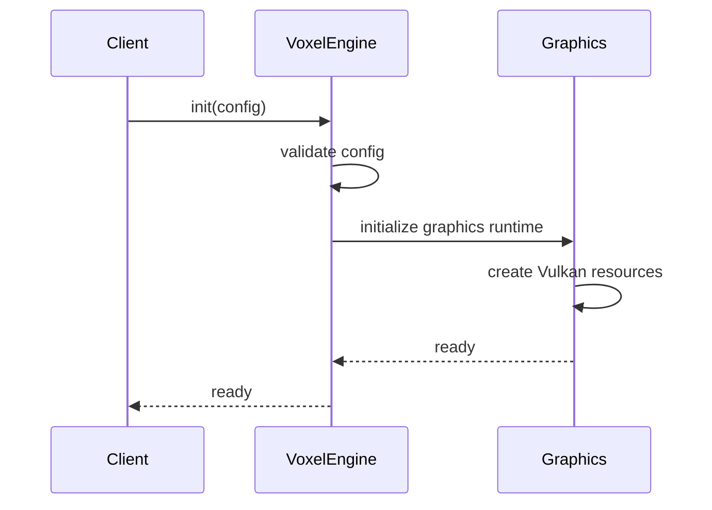
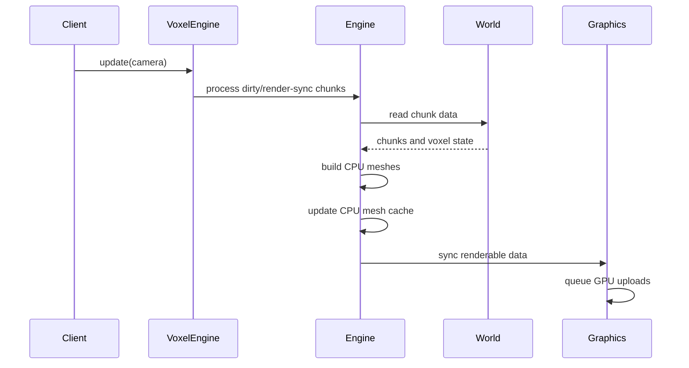
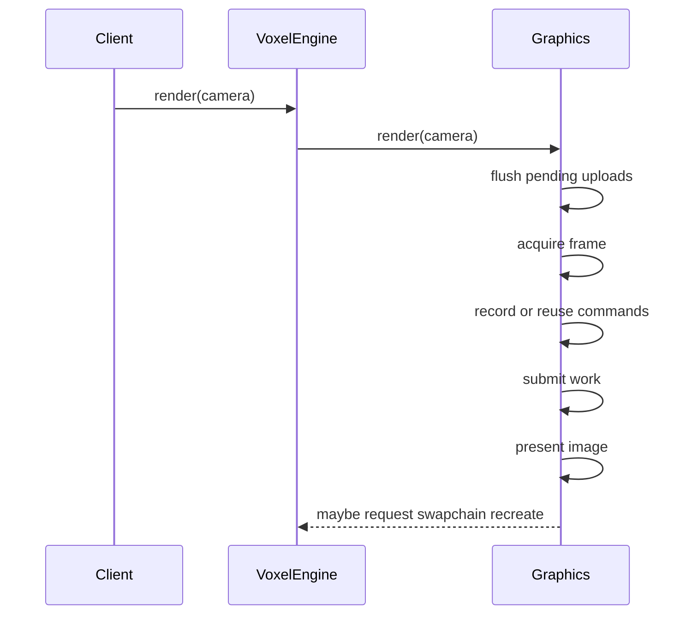
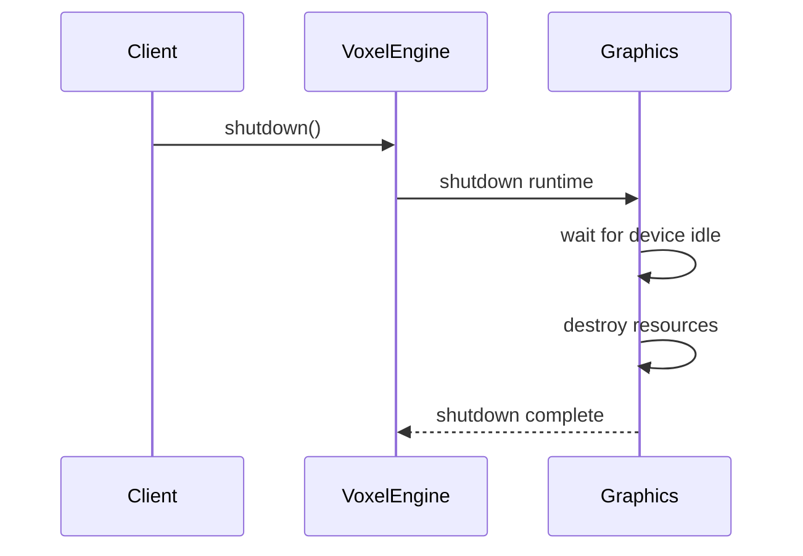
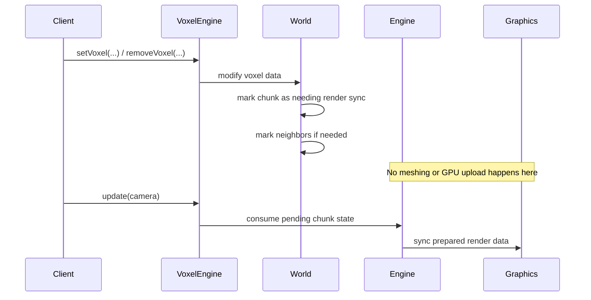
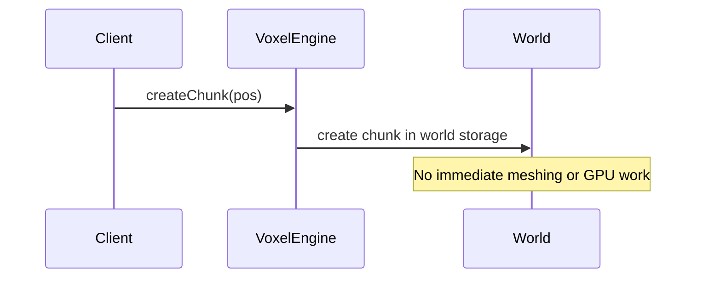
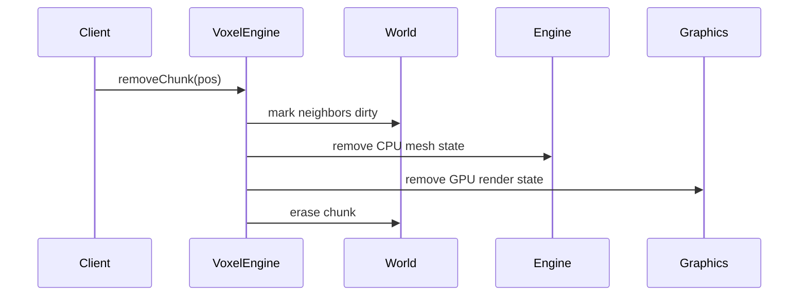

# Public API

## Introduction

`VoxelEngine` is the only public entry point of the library.
Client code drives the engine explicitly through world edits, `update(...)`, and `render(...)`.

The public contract follows a simple split:

- **World edits**
  - change chunk or voxel data
- **`update(...)`**
  - performs CPU-side work
- **`render(...)`**
  - performs graphics-side work

This separation is important: changing world data does not immediately rebuild GPU state.

## Lifecycle API

### `init(const VoxelEngineInitConfig& config)`

**Purpose**

- initialize the engine runtime
- validate integration inputs
- prepare the graphics backend

**When to call**

- once, before any other runtime call such as `update(...)` or `render(...)`

**What it does**

- validates the provided initialization config
- initializes the graphics runtime
- creates Vulkan resources and swapchain-dependent render state
- leaves the engine ready for world edits, updates, and rendering

### `update(const Camera& camera)`

**Purpose**

- run the CPU-side engine step
- turn world-side changes into renderable data

**When to call**

- once per frame, after world edits and before `render(...)`

**What it triggers internally**

- processes chunks that still need render synchronization
- runs CPU meshing
- updates the CPU mesh cache
- synchronizes CPU-side mesh results toward graphics-side chunk state
- queues GPU uploads for the render phase

### `render(const Camera& camera)`

**Purpose**

- execute one graphics frame
- submit work to the GPU

**When to call**

- once per frame, after `update(...)`

**What it triggers internally**

- flushes pending GPU uploads
- acquires a swapchain image
- records or reuses frame commands
- submits the frame
- presents the result
- may request swapchain recreation if the current swapchain is no longer valid

### `shutdown()`

**Purpose**

- shut the engine down explicitly
- release runtime resources in a controlled order

**When to call**

- once, before destroying host-side state the engine still depends on

**What it does**

- waits for the device to become idle
- destroys graphics resources
- releases instance-level Vulkan state

## World Interaction API

### `setVoxel(...)` / `removeVoxel(...)`

These calls update world data immediately, but their rendering effect is deferred.

**What they do now**

- modify voxel data in a chunk
- mark the affected chunk as needing later processing
- mark neighboring chunks as well when boundary visibility may change

**What happens later**

- the next `update(...)` pass consumes that state
- meshing and render synchronization produce the CPU and GPU-side updates needed for rendering

### `createChunk(...)`

This call affects world storage only.

**What it does**

- creates a chunk entry in the world if it does not already exist

**What it does not do**

- does not immediately build meshes
- does not immediately allocate GPU state

### `removeChunk(...)`

This is the most important world-removal call because it affects more than storage.

**What it does**

- marks neighboring chunks for later rebuild where boundary visibility may change
- removes the chunk's CPU mesh state
- removes the chunk's graphics-side render state
- erases the chunk from world storage

### `getVoxel(...)`

This is a read-only world query.

**What it does**

- reads voxel data from world storage

**What it does not do**

- does not trigger meshing
- does not affect graphics state
- does not require `update(...)` or `render(...)`

## Other API

### `getAspectRatio()`

This returns the current aspect ratio from the graphics runtime.

Typical use:

- updating camera projection state in client code

It is a query only.
It does not modify world, engine, or graphics state.

## Key Concepts

- **World edits are deferred**
  - editing chunks or voxels changes world state now, but rendering work happens later
- **`update(...)` prepares data**
  - CPU meshing, CPU mesh cache updates, and render synchronization happen here
- **`render(...)` consumes prepared state**
  - queued uploads are flushed and the frame is executed here
- **CPU and GPU work are separated**
  - this keeps world editing, CPU processing, and graphics execution easier to reason about
