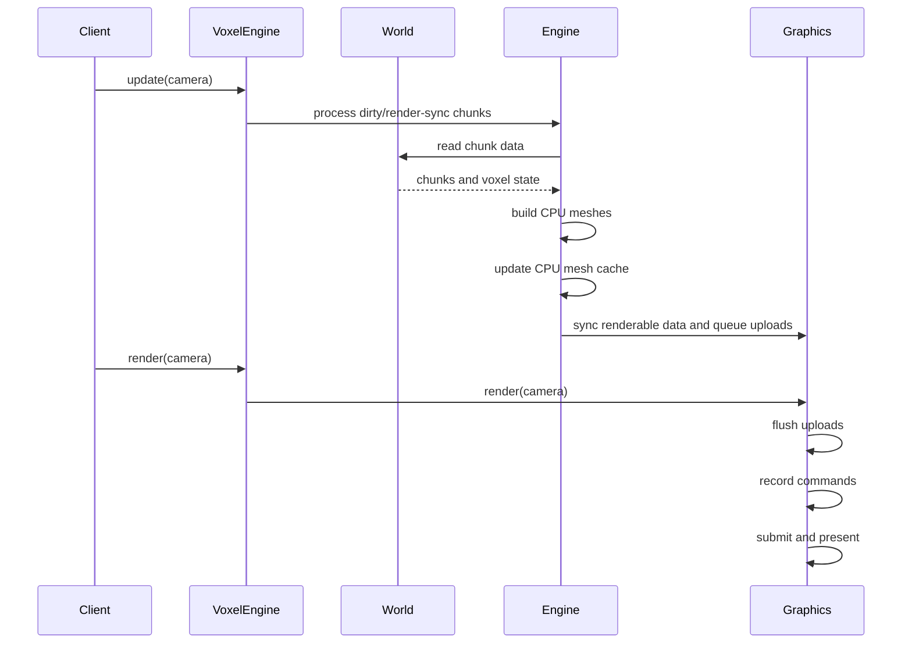
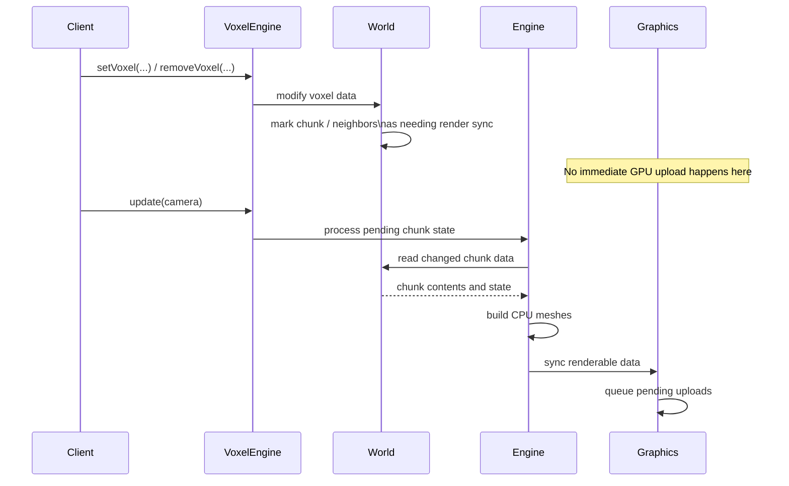
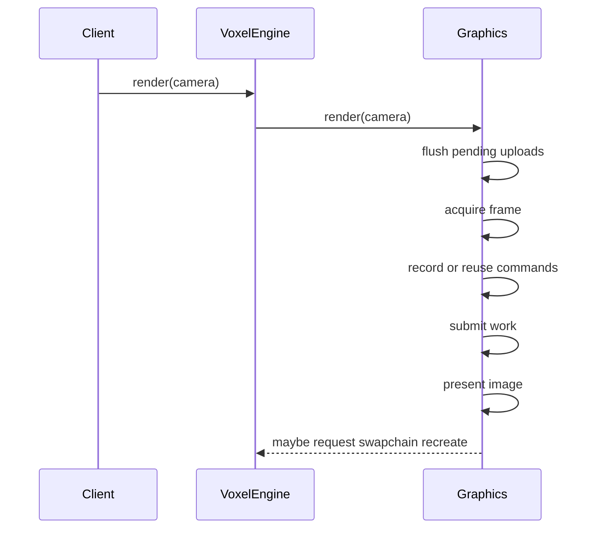
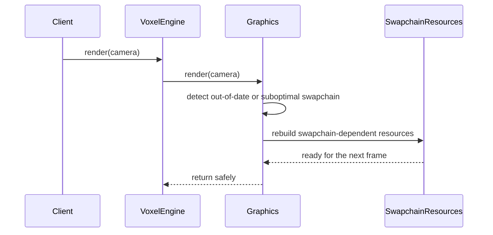

# Runtime Flow

## Overview

The engine is driven by a simple runtime loop:

1. `init(...)`
2. world edits from client code
3. `update(...)`
4. `render(...)`
5. `shutdown()`

The important split is between **update** and **render**:

- `update(...)` performs CPU-side work
- `render(...)` performs graphics-side work

## Frame Update Flow

Voxel edits do not immediately rebuild GPU data.
They first affect world state, then the next `update(...)` pass turns that state into CPU meshes and render-sync work.

### What happens in this phase

- **World edits**
  - client code edits voxel data through `setVoxel(...)` or `removeVoxel(...)`
- **Render-sync state**
  - affected chunks, and sometimes neighbors, are marked for later processing
- **Meshing**
  - `update(...)` rebuilds CPU mesh data for chunks that still need it
- **CPU mesh cache**
  - mesh results are stored in a CPU-side cache instead of going directly to the GPU
- **Render sync**
  - graphics-side chunk state is updated from the CPU mesh cache
- **Pending uploads**
  - buffer uploads are queued for the render phase

`createChunk(...)` only affects world storage.
`removeChunk(...)` also performs immediate CPU and graphics-side cleanup outside this deferred voxel-edit path.

## Render Flow

`render(...)` consumes the prepared graphics-side state and executes the frame.

### What happens in this phase

- **Flush uploads**
  - queued GPU copies are applied before drawing
- **Acquire frame**
  - the graphics runtime acquires a swapchain image
- **Record commands**
  - the frame command buffer is recorded or reused if still valid
- **Submit**
  - the frame is submitted to the graphics queue
- **Present**
  - the rendered image is presented
- **Possible recreate**
  - if the swapchain is no longer valid, the runtime requests recreation

## Swapchain Recreation

Swapchain recreation is triggered by runtime conditions such as resize or out-of-date presentation state.

At a high level, this rebuilds:

- swapchain storage
- image views
- depth resources
- render pass and pipelines
- framebuffers
- frame resources tied to the current swapchain state

Persistent systems such as world data, CPU mesh cache, and graphics-side chunk state remain in place.

## Key Concepts

### Dirty / Render-Sync State

World edits mark chunks as still needing processing.
That state is broader than a simple local modification flag because it remains relevant until meshing and render synchronization have both consumed it.

### CPU Mesh Cache

The engine does not upload raw world data directly to the GPU.
It first builds CPU mesh data and stores it in a mesh cache, which gives render synchronization a stable CPU-side source of truth.

### Update vs Render

`update(...)` is where the engine interprets world changes and prepares renderable data.
`render(...)` is where the graphics runtime flushes uploads, executes the frame, and handles presentation-time swapchain issues.
