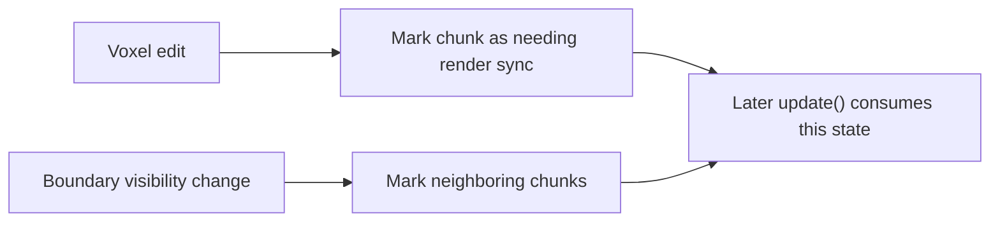

# World Layer

## Purpose

The World layer is the data foundation of the engine.

Its role is to store:

- chunks
- voxels
- chunk-local state needed to drive higher-level processing

It is intentionally kept independent from rendering concerns.

## Chunks and Voxel Storage

World data is organized as chunks containing voxel values.

At this layer:

- chunk storage is responsible for holding voxel data
- chunk coordinates identify where chunk data exists in world space
- voxel values describe the content of a chunk cell

The World layer does not generate meshes and does not know anything about GPU-side representation.

## `ChunkManager`

`ChunkManager` is the main world-side owner of loaded chunks.

At a high level, it is responsible for:

- adding chunks
- removing chunks
- looking up chunks by chunk position
- iterating over currently loaded chunks

This makes it the main entry point for higher layers that need read or write access to world data.

## Render-Sync State

Chunks carry a render-sync state used to signal that their content changed and that higher layers still need to process that change.

In the current architecture, this state is world-originated:

- voxel edits can mark a chunk as needing render synchronization
- boundary-related edits can also mark neighboring chunks as needing render synchronization

Although this state is consumed later by CPU meshing and render synchronization, the World layer itself does not perform those operations.

## Important Boundary

The World layer contains:

- chunk data
- voxel data
- chunk ownership
- chunk-local modification state

The World layer does **not** contain:

- mesh generation
- CPU mesh caching
- GPU resources
- Vulkan objects
- rendering logic

In short, it is a pure data layer, even if its state feeds later stages of the runtime pipeline.
